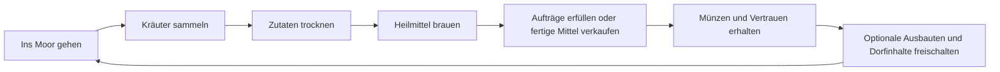

# Die Moor-Apotheke – Spielplan

## 1. Spielidee

Ein gemütliches 2D-Pixelart-Spiel über eine kleine Apotheke am Rand eines geheimnisvollen Moors. Die Spielerin oder der Spieler sammelt Heilpflanzen, verarbeitet sie zu einfachen Mitteln und hilft den Bewohnern eines nahegelegenen Dorfs. Mit den Einnahmen werden optionale Verbesserungen gekauft; benannte Aufträge öffnen die Hauptgebiete. Einmaliges Vertrauen schaltet nur optionale Dorfinhalte frei.

**Arbeitsannahme:** Godot 4 mit GDScript, zunächst mit einfachen Platzhaltergrafiken. Der erste Schwerpunkt liegt auf Erkunden, Herstellen und den Dorfbewohnern. Automatisierung ist ein späterer Ausbau, sobald die kleine Produktionsschleife Spaß macht.

## 2. Leitlinien

- **Entdecken:** Das Moor soll überschaubar, aber interessant sein; Pflanzen und Fundorte sollen sich unterscheiden.
- **Herstellen:** Jede Station macht einen sichtbaren Schritt aus gesammelten Zutaten zu einem brauchbaren Heilmittel.
- **Helfen:** Aufträge erzählen kurz, wer ein Mittel braucht und warum.
- **Entspannt spielen:** Im ersten Ausschnitt gibt es keine knappen Fristen, kein Verderben von Zutaten und keine Strafe fürs Ausprobieren.

## 3. Grafische Richtung (Entwurf)

### Stil

- **Perspektive:** Top-down-Pixelart mit gut lesbaren Wegen, Wasserflächen, Pflanzen und Gebäudeeingängen.
- **Stimmung:** gemütlich und märchenhaft, mit einer leicht geheimnisvollen Mooratmosphäre.
- **Kontrast:** Die Apotheke leuchtet warm in Bernstein, Kerzenorange und Holzbraun. Draußen dominieren entsättigtes Moosgrün, Schilf, Torfbraun und Nebelblau.
- **Blickführung:** Sammelbare Kräuter und benutzbare Stationen erhalten klare Silhouetten und einen kleinen Farb- oder Lichteffekt. Dekoration bleibt ruhiger.
- **Formensprache:** weiche, natürliche Formen bei Pflanzen und Wasser; einfache, robuste Formen bei Möbeln und Werkzeugen.

### Technische Startwerte für die Pixelgrafik

- Kachelraster: **16 × 16 Pixel**.
- Spielfigur: ungefähr **16 × 24 Pixel**, damit sie sich von Bodenkacheln abhebt.
- Virtuelle Spielauflösung: zunächst **480 × 270 Pixel**; Anzeige beispielsweise mit ganzzahliger Skalierung auf einem größeren Fenster.
- Import in Godot mit scharfer Pixel-Darstellung ohne geglättete Kanten.
- Diese Werte sind Startpunkte und werden im laufenden Spiel geprüft.

### Grafikumfang für den ersten Ausschnitt

- Eine Spielfigur mit vier Laufrichtungen und einfacher Standanimation.
- Ein kleines Bodenkachelset für Gras, Torf, Wasser, Weg und Ufer.
- Drei klar unterscheidbare Pflanzen, zwei Verarbeitungsstationen und wenige Moor-Details.
- Eine warme Innenansicht der Apotheke und eine kleine Außenkarte.
- Einfache UI-Rahmen, Gegenstandssymbole und ein gut lesbares Auftragsfenster.

### Arbeitsweise mit Codex

1. Eine Stilbeschreibung und kleine Farbpalette als feste Referenz verwenden.
2. Zuerst einen einzelnen Beispielbildschirm als visuelle Richtung erstellen und gemeinsam prüfen.
3. Danach Grafiken in kleinen Gruppen erstellen: erst Kacheln, dann Pflanzen und Gegenstände, dann Figur und UI.
4. Die generierten Grafiken einzeln in Godot einsetzen und dort bei echter Spielgröße auf Lesbarkeit, Kachelanschlüsse und Transparenz prüfen.
5. Bei jeder weiteren Grafik dieselbe Stilbeschreibung und dieselben Referenzbilder verwenden; nötige Korrekturen an der Referenz sammeln.
6. Den ersten Ausschnitt mit provisorischen Grafiken spielbar machen und die finalen Details danach gezielt ausarbeiten.

Codex kann die Bildideen und Varianten mit dem Bildwerkzeug erzeugen, Prompts und Stilvorgaben konsistent halten und die Dateien in Godot einbinden. Exakte Raster, nahtlose Kachelränder und Animationen sollten anschließend im Spiel kontrolliert und bei Bedarf in einem Pixelart-Editor nachgebessert werden.

## 4. Kern-Spielschleife

## 5. Erster spielbarer Ausschnitt (Vertical Slice)

Ziel ist ein kurzer, vollständiger Spielabschnitt, in dem eine Person vom Verlassen der Apotheke bis zur erfüllten Bestellung alle Hauptschritte selbst erlebt.

Der Vertical Slice begrenzt zunächst die Zahl der Systeme und Gebiete, **nicht die Größe der beiden Startgebiete**. Schilfufer und Alter Torfstich werden bereits in der vorgesehenen vollen Arealgröße gebaut. Die Maß- und Spielzeitvorgaben für alle fünf Gebiete stehen im [Weltentwurf](design/world_design_plan.md) und [Backlog](design/world_backlog.md).

### Inhalt

- Dorfzentrum sowie Schilfufer und Alter Torfstich als zwei große, vollständig begehbare Gebiete; spätere Pfade sind sichtbar und zunächst gesperrt.
- Eine steuerbare Spielfigur mit Laufen, Interagieren und Kamera.
- Drei sammelbare Pflanzen:
  - **Sumpfminze** – häufig, Grundlage für beruhigende Mittel.
  - **Schilfwurzel** – wächst an nassen Ufern, Grundlage für stärkende Mittel.
  - **Nachtmoos** – selten und an schattigen Stellen, Zutat für ein spezielles Rezept.
- Zwei Stationen:
  - **Trockengestell:** frische Pflanzen werden zu getrockneten Zutaten.
  - **Braukessel:** Zutaten werden nach einem Rezept zu einem Heilmittel verarbeitet.
- Drei Rezepte, darunter ein einfaches Startrezept und zwei, die weitere Zutaten benötigen.
- Gegner lassen nach dem Vertreiben mit dem Kräuterstab eine Alchemiezutat fallen; sicheres Vorbeigehen gibt keinen Drop. Optionale Trankrezepte stehen im [Gegnerkatalog](design/enemy_roster.md).
- Drei Dorfbewohner-Aufträge mit unterschiedlichen Bedürfnissen.
- Inventar, Auftragsanzeige und eine einfache Belohnung in Münzen.
- Eine kleine Verbesserung als Abschlussbelohnung, zum Beispiel ein größeres Trockengestell.

### Karte und Inhalte

| Ort | Inhalt und Zweck |
| --- | --- |
| Apotheke | Startpunkt, Inventar und Braukessel |
| Hinterhof | Trockengestell und kurze Einführung |
| Schilfufer | Uferwiesen, Schilflabyrinth und versunkene Fähre; Sumpfminze und Schilfwurzel |
| Alter Torfstich | Torfhof, Grubenstege und alter Torfweg; Nachtmoos als seltener Fund |
| Dorfplatz | Bewohner und Auftragsbrett |

| Zutat | Fundort | Verwendung |
| --- | --- | --- |
| Sumpfminze | Häufig am Ufer | Beruhigungstee und stärkender Aufguss |
| Schilfwurzel | Am Schilfufer | Stärkender Aufguss und Nachttrank |
| Nachtmoos | Schattig am alten Steg | Nachttrank |

| Rezept | Zutaten | Ergebnis | Freischaltung |
| --- | --- | --- | --- |
| Beruhigungstee | 2 getrocknete Sumpfminzen + Wasser | 1 Tee | Von Anfang an |
| Stärkender Aufguss | 1 getrocknete Schilfwurzel + 1 getrocknete Sumpfminze + Wasser | 1 Aufguss | Nach dem ersten Auftrag |
| Nachttrank | 1 getrocknete Schilfwurzel + 1 getrocknetes Nachtmoos + Wasser | 1 Trank | Nach dem zweiten Auftrag |

Die Rezeptmengen sind Startwerte und werden beim Spielen angepasst. Das Wasser ist für den ersten Ausschnitt unbegrenzt am Braukessel verfügbar, damit keine dritte Sammelressource nötig ist.

### Bewohner und Aufträge

| Person | Bitte | Spielziel |
| --- | --- | --- |
| Fenja, die Fährfrau | 1 Beruhigungstee | Führt in Sammeln, Trocknen, Brauen und Abgeben ein |
| Marten, der Torfstecher | 1 stärkender Aufguss | Nutzt zwei Pflanzenarten und schaltet das zweite Rezept frei |
| Lene, die Dorfheilerin | 1 Nachttrank | Führt zum seltenen Fund am alten Steg und schließt den Ausschnitt ab |

Aufträge haben im ersten Ausschnitt keine Ablaufzeit. Die Erfüllung wird durch eine kurze Textzeile, Münzen und einen sichtbaren Vertrauensfortschritt bestätigt.

### Eingaben und Anzeigen

- **WASD oder Pfeiltasten:** laufen.
- **F oder Linksklick:** mit dem Kräuterstab in Blickrichtung angreifen.
- **Leertaste:** angekündigten Angriffen ausweichen.
- **1/2, danach Q:** Schnelltrank auswählen und anwenden oder werfen.
- **E:** mit Pflanze, Station, Bewohner oder Brett interagieren. Gegner werden mit dem Kräuterstab angegriffen.
- **I:** Inventar öffnen und schließen.
- Die HUD zeigt aktuelle Aufgabe, Interaktionshinweis, Münzen, drei Herzen und den gewählten Schnelltrank.
- Stationsfenster zeigen Zutatenplätze, verfügbares Rezept und Herstellungsfortschritt.

Das geplante Kampfsystem mit Trefferregeln, Ausweichschritt und Trankeffekten steht im [Gegnerkatalog](design/enemy_roster.md).

### Nicht Teil des ersten Ausschnitts

- Automatische Förder- oder Verarbeitungsmaschinen.
- Mehrere Jahreszeiten, Wettereffekte und dynamisches Nachwachsen.
- Vollständige spielbare Weltübersicht mit allen fünf Gebieten, umfangreiche Dialoge oder komplexe Beziehungen. Das Karten-Mockup dient zunächst nur als Entwurfsübersicht; die beiden Startgebiete bleiben trotzdem groß und vollständig begehbar.
- Hunger, Energie, Zeitdruck oder verderbliche Waren.
- Eigene finale Pixelart-Assets: Erst Platzhalter verwenden und den Ablauf spielbar machen.

## 6. Geplanter Ablauf im Spiel

1. Eine Bewohnerin bittet um ein Mittel gegen Unwohlsein.
2. Die Spielerin oder der Spieler nimmt den Auftrag am Brett an.
3. Sumpfminze wird im Moor gesammelt.
4. Die Minze wird am Trockengestell verarbeitet.
5. Das passende Rezept wird im Braukessel ausgewählt und hergestellt.
6. Das Heilmittel wird im Dorf abgegeben.
7. Eine feste Storybelohnung und Vertrauen bestätigen den Auftrag; benannte Storyaufträge öffnen das nächste Gebiet, Geld und Vertrauen bleiben für optionale Verbesserungen und Dorfinhalte.

## 7. Entwicklungsphasen und Abschlusskriterien

### Phase 1 – Projektgrundlage

- Godot-4-Projekt mit einer Startszene und klarer Ordnerstruktur anlegen.
- Auflösung, Pixel-Skalierung und Eingaben festlegen.
- Eine Testkarte mit Platzhaltergrafiken erstellen.

**Fertig, wenn:** Das Projekt startet zuverlässig und die Spielfigur lässt sich in einer Szene darstellen.

### Phase 2 – Erkunden und Sammeln

- Bewegung, Kollisionen und Kamera ergänzen.
- Pflanzen als interaktive Objekte platzieren.
- Sammeln und einfache Inventar-Stapel ermöglichen.

**Fertig, wenn:** Alle drei Pflanzen gefunden, eingesammelt und im Inventar angezeigt werden können.

### Phase 3 – Verarbeiten

- Trockengestell und Braukessel als benutzbare Stationen ergänzen.
- Zutaten, verarbeitete Zutaten und Rezepte als Daten abbilden.
- Herstellungsfortschritt und fertige Produkte verständlich anzeigen.

**Fertig, wenn:** Aus gesammelten Pflanzen mindestens ein Heilmittel in einer nachvollziehbaren Kette entsteht.

### Phase 4 – Aufträge und Fortschritt

- Auftragsbrett und drei Bewohner-Aufträge ergänzen.
- Abgabe, Münzbelohnung und einfache Freischaltung umsetzen.
- Den Spielablauf vom Auftrag bis zur Belohnung verbinden.

**Fertig, wenn:** Ein Auftrag angenommen, erfüllt und belohnt werden kann, ohne dass ein Neustart nötig ist.

### Phase 5 – Lesbarkeit und Atmosphäre

- Platzhalter durch eine zusammenhängende kleine Palette und einfache Pixelgrafiken ersetzen.
- Rückmeldungen für Sammeln, Herstellen und Abgeben verbessern.
- Kurze Umgebungsgeräusche und Musik ergänzen, sofern sie den Ablauf unterstützen.

**Fertig, wenn:** Neue Spielende die Hauptschleife ohne Erklärung von außen verstehen.

### Phase 6 – Spieltest und Erweiterungsentscheidung

- Den Ausschnitt wiederholt spielen und unnötige Schritte kürzen.
- Danach die drei noch fehlenden großen Moorgebiete sowie weitere Rezepte und Upgrades gemäß [Ausbaupfad](design/progression_roadmap.md) ergänzen; Schilfufer und Torfstich behalten bereits ihre volle Zielgröße.
- Jahreszeiten und Automatisierung erst nach dem Ausbau der Hauptgebiete als spätere Erweiterungen entscheiden.

**Fertig, wenn:** Die Kernschleife verständlich und unterhaltsam genug ist, um gezielt erweitert zu werden.

### Langfristiger Ausbau

Die Hauptreise erweitert die Apotheke und öffnet die Gebiete nacheinander. Jede Region bringt neue Zutaten, Gegner, Trankrezepte und eine Verbesserung. Nach dem Abschluss der fünf Hauptgebiete folgen freiwillige Aufträge und Unterbereiche ohne Zeitdruck. Die konkreten Stufen stehen im [Ausbaupfad](design/progression_roadmap.md).

## 8. Technische Leitplanken

- Zuerst Godots eingebaute Werkzeuge und einfache Szenen verwenden.
- Gegenstände, Rezepte und Aufträge möglichst als Daten statt fest im UI-Code pflegen.
- Ressourcenverwendungen, Trankrezepte, Verkaufspreise und Ausbaukosten nach [Ressourcenplan](design/resource_economy.md) pflegen.
- Die ersten Interaktionen klein halten: Objekt ansehen, benutzen, Ergebnis sehen.
- Stationen zunächst mit klaren Eingabe- und Ausgabeplätzen bauen; keine komplexe Fabriklogik vorziehen.
- Verarbeitung anfangs direkt und leicht nachvollziehbar halten; Produktionszeiten sind optional und kurz.
- Git für kleine, nachvollziehbare Arbeitsschritte verwenden.
- Speichern und Laden ergänzen, sobald Karte, Inventar und Aufträge stabil zusammenspielen.

## 9. Entscheidungen für die nächste Planrunde

- **Ansicht:** Top-down ist der Vorschlag, weil Sammeln und Wege im Moor damit leicht lesbar sind.
- **Schwerpunkt:** Für den Anfang ist eine Mischung aus Erkunden, Aufträgen und einfacher Verarbeitung vorgesehen; Automatisierung kommt später.
- **Spieltempo:** Der erste Ausschnitt bleibt ohne Zeitdruck. Jahreszeiten können später die Fundorte und Rezepte verändern.
- **Geschichte und Ton:** Noch offen; Vorschlag ist märchenhaft und gemütlich, mit etwas geheimnisvoller Moorstimmung.

## 10. Nächster konkreter Arbeitsschritt

MAP-01 bis MAP-03 sind abgeschlossen: Dorfplatz und fünf Wege sind angelegt, und beide Startkarten nutzen ein gemeinsames Moor-TileSet. Als Nächstes wird mit SCALE-01 der Maßstab und Inhaltsumfang der Gebiete konkret umgesetzt; danach folgen REG-01 (Schilfufer) und REG-02 (Alter Torfstich) gemäß [Welt-Backlog](design/world_backlog.md). Die neuen Welt- und Fortschrittsdokumente unter `design/` sind dafür maßgeblich.
