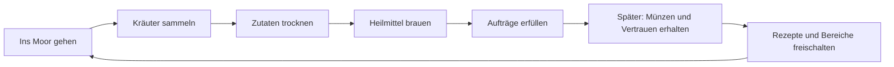

# Die Moor-Apotheke – Spielplan

## 1. Spielidee

Ein gemütliches 2D-Pixelart-Spiel über eine kleine Apotheke am Rand eines geheimnisvollen Moors. Die Spielerin oder der Spieler sammelt Heilpflanzen, verarbeitet sie zu einfachen Mitteln und hilft den Bewohnern eines nahegelegenen Dorfs. In späteren Ausbaustufen schalten Einnahmen und das Vertrauen der Gemeinschaft neue Rezepte, Moorgebiete und praktische Produktionshilfen frei.

**Arbeitsannahme:** Godot 4 mit GDScript, zunächst mit einfachen Platzhaltergrafiken. Der erste Schwerpunkt liegt auf Erkunden, Herstellen und den Dorfbewohnern. Automatisierung ist ein späterer Ausbau, sobald die kleine Produktionsschleife Spaß macht.

## 2. Leitlinien

- **Entdecken:** Das Moor soll überschaubar, aber interessant sein; Pflanzen und Fundorte sollen sich unterscheiden.
- **Herstellen:** Jede Station macht einen sichtbaren Schritt aus gesammelten Zutaten zu einem brauchbaren Heilmittel.
- **Helfen:** Aufträge erzählen kurz, wer ein Mittel braucht und warum.
- **Entspannt spielen:** Im ersten Ausschnitt gibt es keine knappen Fristen, kein Verderben von Zutaten und keine Strafe fürs Ausprobieren.

## 3. Grafische Richtung (Entwurf)

### Stil

- **Perspektive:** Top-down-Pixelart mit gut lesbaren Wegen, Wasserflächen, Pflanzen und Gebäudeeingängen.
- **Stimmung:** gemütlich und märchenhaft, mit einer leicht geheimnisvollen Mooratmosphäre.
- **Kontrast:** Die Apotheke leuchtet warm in Bernstein, Kerzenorange und Holzbraun. Draußen dominieren entsättigtes Moosgrün, Schilf, Torfbraun und Nebelblau.
- **Blickführung:** Sammelbare Kräuter und benutzbare Stationen erhalten klare Silhouetten und einen kleinen Farb- oder Lichteffekt. Dekoration bleibt ruhiger.
- **Formensprache:** weiche, natürliche Formen bei Pflanzen und Wasser; einfache, robuste Formen bei Möbeln und Werkzeugen.

### Technische Startwerte für die Pixelgrafik

- Kachelraster: **16 × 16 Pixel**.
- Spielfigur: ungefähr **16 × 24 Pixel**, damit sie sich von Bodenkacheln abhebt.
- Virtuelle Spielauflösung: zunächst **480 × 270 Pixel**; Anzeige beispielsweise mit ganzzahliger Skalierung auf einem größeren Fenster.
- Import in Godot mit scharfer Pixel-Darstellung ohne geglättete Kanten.
- Diese Werte sind Startpunkte und werden im laufenden Spiel geprüft.

### Grafikumfang

Für den ersten Kernablauf genügen eine Platzhalterfigur, eine kleine Außenfläche mit Ufer, Sumpfminze, Trockengestell, Braukessel und Fenja sowie eine einfache Anzeige für Aufgabe und Inventar. Das erweiterte Spiel kann später drei Pflanzen, weitere Orte, Figuren und ein Auftragsbrett ergänzen.

### Arbeitsweise mit Codex

1. Eine Stilbeschreibung und kleine Farbpalette als feste Referenz verwenden.
2. Zuerst einen einzelnen Beispielbildschirm als visuelle Richtung erstellen und gemeinsam prüfen.
3. Danach Grafiken in kleinen Gruppen erstellen: erst Kacheln, dann Pflanzen und Gegenstände, dann Figur und UI.
4. Die generierten Grafiken einzeln in Godot einsetzen und dort bei echter Spielgröße auf Lesbarkeit, Kachelanschlüsse und Transparenz prüfen.
5. Bei jeder weiteren Grafik dieselbe Stilbeschreibung und dieselben Referenzbilder verwenden; nötige Korrekturen an der Referenz sammeln.
6. Den ersten Ausschnitt mit provisorischen Grafiken spielbar machen und die finalen Details danach gezielt ausarbeiten.

Codex kann die Bildideen und Varianten mit dem Bildwerkzeug erzeugen, Prompts und Stilvorgaben konsistent halten und die Dateien in Godot einbinden. Exakte Raster, nahtlose Kachelränder und Animationen sollten anschließend im Spiel kontrolliert und bei Bedarf in einem Pixelart-Editor nachgebessert werden.

## 4. Kern-Spielschleife

## 5. Erster spielbarer Ausschnitt (Vertical Slice)

Ziel ist ein kurzer, vollständiger Spielabschnitt, in dem eine Person vom Verlassen der Apotheke bis zur erfüllten Bestellung alle Hauptschritte selbst erlebt.

### Umfang in zwei Stufen

**Erster Kernablauf:** Eine Bitte direkt bei Fenja annehmen, eine Sumpfminze sammeln, am Trockengestell verarbeiten, am Braukessel einen Beruhigungstee herstellen und den Tee Fenja direkt geben. Ein einfaches Bestätigungsfeedback reicht als erste Belohnung. Das Auftragsbrett, seltene Pflanzen, Vertrauenssystem und Freischaltungen sind dafür noch nicht nötig.

**Erweiterter Vertical Slice:** Danach folgen Schilfwurzel, Nachtmoos, zwei weitere Rezepte, Marten, Lene, das Auftragsbrett und eine einfache Münzbelohnung. Diese Erweiterungen verwenden dieselbe getestete Kernschleife.

### Inhalt

- **Erster Kernablauf:** eine kleine Außenfläche, eine steuerbare Figur, eine Sammelstelle für Sumpfminze, je eine Verarbeitungsstation und Fenja als Auftraggeberin. Inventar und Aufgabe werden einfach angezeigt.
- **Erweiterte Inhalte:** eine größere Moor-Karte mit Apotheke, Dorfweg und drei Sammelstellen; drei sammelbare Pflanzen:
  - **Sumpfminze** – häufig, Grundlage für beruhigende Mittel.
  - **Schilfwurzel** – wächst an nassen Ufern, Grundlage für stärkende Mittel.
  - **Nachtmoos** – selten und an schattigen Stellen, Zutat für ein spezielles Rezept.
- Zwei Stationen:
  - **Trockengestell:** frische Pflanzen werden zu getrockneten Zutaten.
  - **Braukessel:** Zutaten werden nach einem Rezept zu einem Heilmittel verarbeitet.
- Drei Rezepte, darunter ein einfaches Startrezept und zwei, die weitere Zutaten benötigen.
- Drei Dorfbewohner-Aufträge mit unterschiedlichen Bedürfnissen.
- Inventar, Auftragsanzeige und eine einfache Belohnung in Münzen.
- Eine kleine Verbesserung als Abschlussbelohnung, zum Beispiel ein größeres Trockengestell.

### Karte und Inhalte

| Ort | Inhalt und Zweck |
| --- | --- |
| Apotheke | Startpunkt, Inventar und Braukessel |
| Hinterhof | Trockengestell und kurze Einführung |
| Schilfufer | Sumpfminze und Schilfwurzel |
| Alter Torfsteg | Nachtmoos als seltener Fund |
| Dorfplatz | Bewohner und Auftragsbrett |

| Zutat | Fundort | Verwendung |
| --- | --- | --- |
| Sumpfminze | Häufig am Ufer | Beruhigungstee und stärkender Aufguss |
| Schilfwurzel | Am Schilfufer | Stärkender Aufguss und Nachttrank |
| Nachtmoos | Schattig am alten Steg | Nachttrank |

| Rezept | Zutaten | Ergebnis | Freischaltung |
| --- | --- | --- | --- |
| Beruhigungstee | 1 getrocknete Sumpfminze + Wasser | 1 Tee | Von Anfang an |
| Stärkender Aufguss | 1 getrocknete Schilfwurzel + 1 getrocknete Sumpfminze + Wasser | 1 Aufguss | Nach dem ersten Auftrag |
| Nachttrank | 1 getrocknete Schilfwurzel + 1 getrocknetes Nachtmoos + Wasser | 1 Trank | Nach dem zweiten Auftrag |

Die Rezeptmengen sind Startwerte und werden beim Spielen angepasst. Eine Sumpfminze ergibt eine getrocknete Minze. Das Wasser ist unbegrenzt am Braukessel verfügbar, damit keine dritte Sammelressource nötig ist.

### Bewohner und Aufträge

| Person | Bitte | Spielziel |
| --- | --- | --- |
| Fenja, die Fährfrau | 1 Beruhigungstee | Führt in Sammeln, Trocknen, Brauen und Abgeben ein |
| Marten, der Torfstecher | 1 stärkender Aufguss | Nutzt zwei Pflanzenarten und führt die Bewohner-Auftragskette fort |
| Lene, die Dorfheilerin | 1 Nachttrank | Führt zum seltenen Fund am alten Steg und schließt den Ausschnitt ab |

Fenjas Bitte hat im ersten Kernablauf keine Ablaufzeit. Nach der Annahme zeigt die HUD das aktive Ziel; bei erfolgreicher Abgabe bleibt der Abschluss bis zum Ende der laufenden Partie sichtbar. Der Queststatus wird in diesem ersten Slice noch nicht gespeichert. Münzen und Vertrauensfortschritt gehören zu einer späteren Ausbaustufe.

### Eingaben und Anzeigen

- **WASD oder Pfeiltasten:** laufen.
- **E:** mit Pflanze, Station, Bewohner oder Brett interagieren.
- **I:** Inventar öffnen und schließen.
- Die HUD zeigt aktuelle Aufgabe, Interaktionshinweis und Münzen.
- Stationsfenster zeigen Zutatenplätze, verfügbares Rezept und Herstellungsfortschritt.

### Nicht Teil des ersten Ausschnitts

- Automatische Förder- oder Verarbeitungsmaschinen.
- Mehrere Jahreszeiten, Wettereffekte und dynamisches Nachwachsen.
- Große Weltkarte, umfangreiche Dialoge oder komplexe Beziehungen.
- Hunger, Energie, Zeitdruck oder verderbliche Waren.
- Eigene finale Pixelart-Assets: Erst Platzhalter verwenden und den Ablauf spielbar machen.

## 6. Geplanter Ablauf im Spiel

1. Eine Bewohnerin bittet um ein Mittel gegen Unwohlsein.
2. Die Spielerin oder der Spieler nimmt Fenjas Bitte direkt bei ihr an.
3. Sumpfminze wird im Moor gesammelt.
4. Die Minze wird am Trockengestell verarbeitet.
5. Das passende Rezept wird im Braukessel ausgewählt und hergestellt.
6. Das Heilmittel wird Fenja direkt gegeben und der Abschluss bestätigt.
7. Im späteren Ausbau schalten Münzen und Vertrauen eine Verbesserung oder das nächste Rezept frei.

## 7. Entwicklungsphasen und Abschlusskriterien

### Phase 1 – Projektgrundlage

- Godot-4-Projekt mit einer Startszene und klarer Ordnerstruktur anlegen.
- Auflösung, Pixel-Skalierung und Eingaben festlegen.
- Eine Testkarte mit Platzhaltergrafiken erstellen.

**Fertig, wenn:** Das Projekt startet zuverlässig und die Spielfigur lässt sich in einer Szene darstellen.

### Phase 2 – Erkunden und Sammeln

- Bewegung, Kollisionen und Kamera ergänzen.
- Pflanzen als interaktive Objekte platzieren.
- Sammeln und einfache Inventar-Stapel ermöglichen.

**Fertig, wenn:** Sumpfminze gefunden, eingesammelt und im Inventar angezeigt werden kann. Die zwei weiteren Pflanzen folgen nach dem ersten Kernablauftest.

### Phase 3 – Verarbeiten

- Trockengestell und Braukessel als benutzbare Stationen ergänzen.
- Zutaten, verarbeitete Zutaten und Rezepte als Daten abbilden.
- Herstellungsfortschritt und fertige Produkte verständlich anzeigen.

**Fertig, wenn:** Aus gesammelten Pflanzen mindestens ein Heilmittel in einer nachvollziehbaren Kette entsteht.

### Phase 4 – Aufträge und Fortschritt

- Fenjas Auftrag direkt bei ihr annehmen und das Heilmittel direkt bei ihr abgeben. Das Auftragsbrett und weitere Bewohner folgen später.
- Fenja den Tee direkt geben und den Abschluss verständlich bestätigen.
- Den Spielablauf vom Auftrag bis zur Bestätigung verbinden.

**Erledigt in QUEST-001:** Fenja nimmt den Auftrag an, die HUD zeigt das Ziel, ein Tee wird abgegeben und der Abschluss bleibt für die laufende Partie sichtbar. Spielstandpersistenz ist ein späterer eigener Task.

### Phase 5 – Lesbarkeit und Atmosphäre

- Platzhalter durch eine zusammenhängende kleine Palette und einfache Pixelgrafiken ersetzen.
- Rückmeldungen für Sammeln, Herstellen und Abgeben verbessern.
- Während Fenjas Auftrag das nächste Ziel passend zum Inventar dauerhaft in der HUD anzeigen.
- Kurze Umgebungsgeräusche und Musik ergänzen, sofern sie den Ablauf unterstützen.

**In UX-001 umgesetzt:** Die aktive Aufgabe führt dauerhaft durch Sammeln, Trocknen, Brauen und Abgabe; kurze Interaktionsrückmeldungen bleiben ergänzend. Ob neue Spielende den Ablauf ohne Erklärung verstehen, muss noch manuell getestet werden.

### Phase 6 – Spieltest und Erweiterungsentscheidung

- Den Ausschnitt wiederholt spielen und unnötige Schritte kürzen.
- Danach entscheiden, ob als Nächstes Jahreszeiten, neue Moorbereiche oder erste Automatisierung folgen.

**Fertig, wenn:** Die Kernschleife verständlich und unterhaltsam genug ist, um gezielt erweitert zu werden.

## 8. Technische Leitplanken

- Zuerst Godots eingebaute Werkzeuge und einfache Szenen verwenden.
- Gegenstände, Rezepte und Aufträge möglichst als Daten statt fest im UI-Code pflegen.
- Die ersten Interaktionen klein halten: Objekt ansehen, benutzen, Ergebnis sehen.
- Stationen zunächst mit klaren Eingabe- und Ausgabeplätzen bauen; keine komplexe Fabriklogik vorziehen.
- Verarbeitung anfangs direkt und leicht nachvollziehbar halten; Produktionszeiten sind optional und kurz.
- Git für kleine, nachvollziehbare Arbeitsschritte verwenden.
- Speichern und Laden ergänzen, sobald Karte, Inventar und Aufträge stabil zusammenspielen.

## 9. Entscheidungen für die nächste Planrunde

- **Ansicht:** Top-down ist der Vorschlag, weil Sammeln und Wege im Moor damit leicht lesbar sind.
- **Schwerpunkt:** Für den Anfang ist eine Mischung aus Erkunden, Aufträgen und einfacher Verarbeitung vorgesehen; Automatisierung kommt später.
- **Spieltempo:** Der erste Ausschnitt bleibt ohne Zeitdruck. Jahreszeiten können später die Fundorte und Rezepte verändern.
- **Geschichte und Ton:** Noch offen; Vorschlag ist märchenhaft und gemütlich, mit etwas geheimnisvoller Moorstimmung.

## 10. Nächster konkreter Arbeitsschritt

Der erweiterte Vertical Slice umfasst Schilfwurzel sammeln und trocknen, den stärkenden Aufguss, Martens Folgeauftrag, Nachtmoos sammeln und trocknen, den freigeschalteten Nachttrank sowie Lenes Bitte und die Abgabe. Als Nächstes folgt das Auftragsbrett; Münzbelohnung bleibt ein eigener Schritt. So wird jede neue Zutat, Verarbeitung oder Aufgabe gegen die bestehende Kernschleife geprüft.
