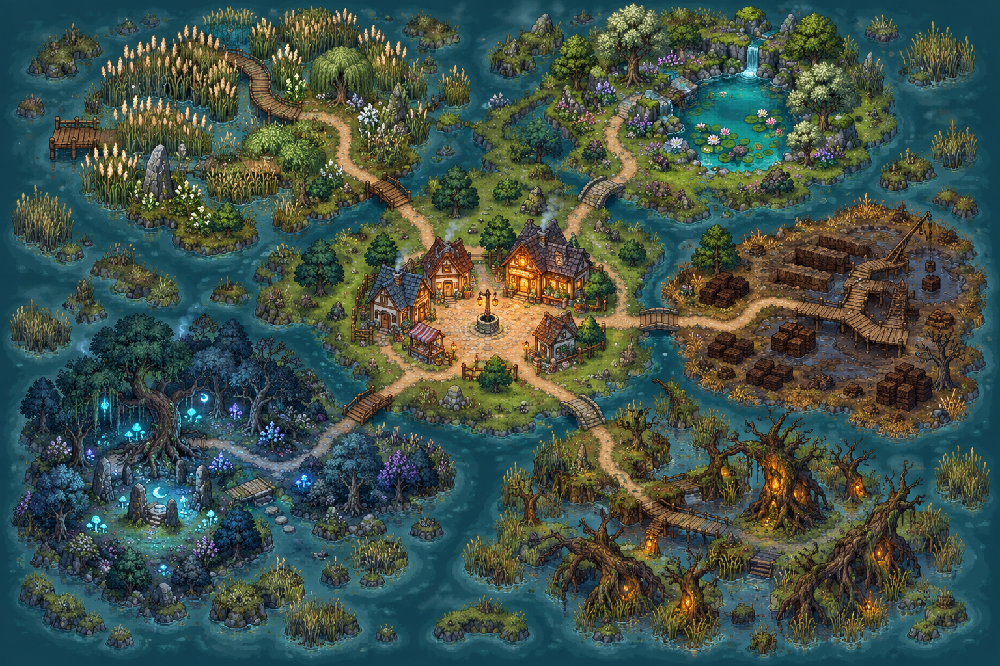

# Weltentwurf: Dorf und Moorgebiete

**Umsetzung:** [Welt-Backlog mit Aufgaben und Abschlusskriterien](world_backlog.md)

**Langfristiger Ausbau:** [Stufenplan für Gebiete, Rezepte und Verbesserungen](progression_roadmap.md)

**Ressourcen und Verkauf:** [Vollständiger Ressourcen- und Wirtschaftsentwurf](resource_economy.md)

Das Mockup zeigt die gewünschte Grundform: ein Dorf mit Apotheke in der Kartenmitte, fünf klar unterscheidbare Sammelgebiete außen herum und sichtbare Pfade mit Stegen über das Wasser. Es ist eine **Weltübersicht, kein Größenmaßstab**: Jedes Gebiet wird im Spiel als großes, mehrteiliges Areal gebaut und bekommt deutlich mehr Fläche als die kleine Darstellung im Mockup vermuten lässt.

## Maßstab und Spielzeit

- Bei 480×270 Pixeln und 16×16-Kacheln zeigt ein Bildschirm ungefähr 30×17 Kacheln.
- Jedes Moorgebiet umfasst mindestens etwa **4×3 Bildschirmansichten begehbaren Raum** (grob 120×51 Kacheln), mit größeren Gebieten bis etwa 5×4 Ansichten. Wasser und leere Randflächen zählen nicht zur begehbaren Fläche.
- Jedes Gebiet hat mindestens drei klar erkennbare Teilbereiche, zwei Nebenwege, eine Rundroute oder Abkürzung, drei markante Orte, mehrere Fundstellen und ein optionales Geheimnis.
- Ziel pro Gebiet: ungefähr **25–40 Minuten bei gründlicher Ersterkundung**, einschließlich örtlicher Aufgabe, Sammeln, Begegnungen und optionaler Schleife. Wer dem Hauptpfad folgt, soll schneller weiterkommen. Das ist ein zu prüfender Richtwert, keine garantierte Spielzeit.
- Erwartete Gesamtdauer: **etwa 3–4 Stunden für den Hauptpfad** und **4–6 Stunden mit gründlicher Erkundung, Geheimorten und einigen freiwilligen Aufträgen**. Auch diese Werte sind Spieltest-Hypothesen. Die Gebietszeit enthält die örtliche Aufgabe bereits; Aufgaben werden bei der Gesamtrechnung nicht doppelt gezählt.
- Die fünf gründlichen Erstbesuche ergeben zusammen ungefähr 2–3⅓ Stunden. Dorfgespräche, Brauen, Rückwege und Ausbauten bringen etwa 45–75 Minuten dazu; optionale Geheimnisse und Aufträge liefern die zusätzliche Spielzeit bis zum 4–6-Stunden-Ziel.
- Die Zeit soll aus Entdecken, Aufträgen, Rezepten und optionalen Fundorten entstehen, nicht aus leeren Laufstrecken oder Wartezeiten.

## Karte und Ressourcen

Alle Wege führen zurück zum Dorfplatz. Die Pfade sind von Anfang an sichtbar; einzelne Stege oder Abzweige werden durch benannte Aufträge und Entdeckungen freigeschaltet. So sind die nächsten Ziele schon früh erkennbar.

| Gebiet | Lage im Mockup | Teilbereiche für das große Areal | Eigene Ressourcen | Einsatz im Spiel |
| --- | --- | --- | --- | --- |
| Schilfufer | Nordwesten | Uferwiesen, Schilflabyrinth, versunkene Fähre | Sumpfminze, Schilfwurzel | Beruhigende und stärkende Mittel; übernimmt die bisherigen Startpflanzen. |
| Quellsenke | Nordosten | Oberer Wasserfall, Seerosenteich, Quellgrotte | Quellperle, Seerosenwurzel | Heilmittel, Kräuterbuch und Sumpfstiefel. Kesselwasser bleibt für das erste Spielstück kostenlos. |
| Alter Torfstich | Osten | Torfhof, Grubenstege, alter Torfweg | Nachtmoos, Torfherz | Seltene Tränke und Material für den Ausbau des Trockengestells. Das Nachtmoos bleibt am alten Steg. |
| Nebelhain | Südwesten | Äußerer Nebelpfad, Flüsterlichtung, alter Steinkreis | Flüsterpilz, Irrlichtstaub | Mittel gegen Furcht und Zutaten für Schutzzauber. |
| Versunkener Wurzelhain | Südosten | Wurzelrand, Harzkanäle, innere Lichtung | Wurzelrinde, Harzbeere | Robuste Ausrüstung und stärkende Mittel. |

Die Pflanzenressourcen bleiben jeweils an ihr Gebiet gebunden. Pflanzen und seltene Fundstellen stehen nach einer Rückkehr ins Dorf wieder bereit; vertriebene Gegner kehren ebenfalls zurück. Ein Gegner gilt als besiegt, wenn er vertrieben wurde; bloßes Vorbeigehen ist sicher, bringt aber keinen Drop. Jede vertriebene Begegnung liefert eine Alchemiezutat, die in mindestens einem konkreten Trankrezept verwendet wird. Es gibt keinen Verderb und keinen Zeitdruck. Zutaten, Rezepte, Verkaufswerte und Upgrade-Kosten stehen im [Ressourcen- und Wirtschaftsentwurf](resource_economy.md); Gegnerdrops und ihre Rezepte im [Gegnerkatalog](enemy_roster.md).

## Gegner je Gebiet

Jedes Gebiet erhält zunächst einen gewöhnlichen Gegner und eine seltene, stärkere Variante. Gegner bewachen Fundstellen oder patrouillieren nahe der Wege. Ein Ausweichen, Ablenken oder kurzes Abwehren soll reichen; eingesammelte Gegenstände gehen bei einem Treffer nicht verloren. Die detaillierte Liste mit Aussehen, Angriffsmustern und Gegenmaßnahmen steht im [Gegnerkatalog](enemy_roster.md).

| Gebiet | Gewöhnlicher Gegner | Seltene Variante | Verhalten und Umgang |
| --- | --- | --- | --- |
| Schilfufer | Schilfschnapper | Mückenschwarm | Der Schnapper lauert im Schilf; der Schwarm verlangsamt kurz. Mit Abstand umgehen oder mit einer Laterne vertreiben. |
| Quellsenke | Blasenkröte | Quellwächter | Blasen schubsen die Figur zurück; der Wächter bewacht eine optionale Fundstelle. Nach zwei verfehlten Stampfern lässt er den Weg kurz frei. |
| Alter Torfstich | Moorwühler | Irrlicht | Der Wühler kündigt seinen Angriff sichtbar an; das Irrlicht lockt von Pfaden weg. Auf den Stegen bleiben oder die Laterne einsetzen. |
| Nebelhain | Nebelkrähe | Wurzelhocker | Die Krähe stößt im Vorbeiflug herab; Wurzeln halten kurz fest. Eine Schutzsalbe oder ein Ausweichschritt löst die Begegnung. |
| Versunkener Wurzelhain | Rankenläufer | Bernsteinwächter | Ranken greifen in einem klar erkennbaren Bereich an; der Wächter bewacht Harz. Mit Schutztrank abwehren oder an ihm vorbeischleichen. |

Jede vertriebene Gegnerbegegnung liefert genau eine passende alchemistische Zutat. Gegner sind nicht nötig, um die Hauptgeschichte abzuschließen. Wer an einem Gegner vorbeigeht, erhält keinen Drop. Niederlagen bringen die Figur zum letzten sicheren Wegpunkt zurück, ohne Zutaten oder Münzen aus dem Inventar zu entfernen.

## Verbesserungen und Fortschritt

Verbesserungen werden in der Apotheke oder am Dorfbrett freigeschaltet. Münzen aus Aufträgen und einige passende Gebietszutaten geben dem Sammeln einen zweiten Zweck.

| Bereich | Verbesserung | Wirkung |
| --- | --- | --- |
| Erkunden | Sumpfstiefel | Weniger verlangsamtes Laufen im Matsch; später Zugang zu flachen Wasserwegen. |
| Erkunden | Wanderbeutel | Mehr Platz für Zutaten auf einem Ausflug. |
| Erkunden | Laterne | Macht seltene Fundstellen im Nebel sichtbar und vertreibt einfache Gegner kurz. |
| Herstellung | Größeres Trockengestell | Verarbeitet mehr Pflanzen pro Arbeitsgang. |
| Herstellung | Verbesserter Braukessel | Braut später zwei Portionen zugleich und schaltet anspruchsvollere Rezepte frei. |
| Dorf | Kräuterbuch | Markiert bekannte Fundorte und zeigt, welche Zutat für freigeschaltete Rezepte fehlt. |

### Freischaltfolge

| Reihenfolge | Zugang wird freigeschaltet, wenn … | Neues Gebiet | Nächster Schritt |
| --- | --- | --- | --- |
| 1 | das Spiel beginnt | Dorfplatz und Schilfufer | Fenjas erster Auftrag führt Sammeln, Trocknen und Brauen ein. |
| 2 | Fenjas Beruhigungstee abgegeben wurde | Alter Torfstich | Die erste Verbesserung wird gewählt. Das Nachtmoos für Lenes Auftrag wird nun erreichbar. |
| 3 | Martens stärkender Aufguss abgegeben wurde | Quellsenke | Der reparierte Nordsteg öffnet den Zugang zu Quellperle und Seerosenwurzel. |
| 4 | Lenes Nachttrank abgegeben wurde | Nebelhain | Der südwestliche Pfad wird geöffnet; Flüsterpilz und Irrlichtstaub werden erreichbar. |
| 5 | je ein Auftrag in Quellsenke und Nebelhain erfüllt sowie Quellperle und Irrlichtstaub entdeckt und Lene davon berichtet wurde | Versunkener Wurzelhain | Die Erstfunde werden automatisch im Aufgabenfortschritt vermerkt; dafür muss das optionale Kräuterbuch nicht gekauft werden und die Zutaten werden nicht verbraucht. Lene bündelt die Funde in den regionalen Forschungsnotizen. |

Die späteren Wege sind von Anfang an sichtbar, aber durch einen reparaturbedürftigen Steg oder ein klares Hindernis gesperrt. Beim Untersuchen zeigt der Übergang die konkrete Freischaltbedingung. Ein freigeschalteter Weg bleibt offen. Hauptwege hängen an benannten Aufträgen und automatisch gespeicherten Erstfunden, nicht am optionalen Kräuterbuch, Münzen, wiederholbaren Aufträgen oder einem Vertrauenswert. Kein Gebiet verlangt, dass ein Gegner besiegt werden muss; Gegner können umgangen werden.

Nach Fenjas Auftrag gibt es die erste kleine Wahl: Wanderbeutel oder größeres Trockengestell. Weitere Verbesserungen werden mit Münzen und Gebietszutaten gekauft. Ihre Startwirkungen und Kosten stehen im [Ressourcen- und Wirtschaftsentwurf](resource_economy.md) und sind Balancewerte für Spieltests. Laterne und Sumpfstiefel helfen bei Erkundung, sind aber keine Eintrittskarte für ein Gebiet.

## Umsetzungsplan

1. **Dorf als Kartenmitte:** Dorfplatz und Apotheke platzieren, fünf gut lesbare Pfade samt Brücken anlegen und die vorhandenen Sammelpunkte auf die passenden Gebiete verteilen.
2. **Gebiete unterscheidbar machen:** Erst Schilfufer und Torfstich mit den bestehenden Pflanzen fertigstellen; danach Quellsenke, Nebelhain und Wurzelhain mit eigenen Farben, Silhouetten und Ressourcen ergänzen.
3. **Gegner-Grundsystem:** Sichtbare Warnung, Ausweichen/Abwehren, kurze Erholung und sichere Rückkehr einführen. Zunächst je ein gewöhnlicher Gegner in zwei Gebieten testen, danach die Varianten ergänzen.
4. **Aufträge und Freischaltungen:** Benannte Storyaufträge und automatisch gespeicherte Erstfunde öffnen die Hauptwege. Dorfvertrauen schaltet nur optionale Dorfinhalte frei.
5. **Upgrade-Menü:** Zuerst die Startwahl zwischen Wanderbeutel und Trockengestell; Kräuterbuch und Sumpfstiefel folgen nach Öffnung der Quellsenke, die Laterne nach Öffnung des Nebelhains und der Kessel-Ausbau nach der Hauptreise.

### Erster spielbarer Umfang

Für den ersten Ausbau genügen Dorfzentrum, Schilfufer und Alter Torfstich, drei vorhandene Kräuter, zwei Gegnertypen und eine Verbesserung. **Die zwei Startgebiete werden trotzdem bereits in voller Zielgröße gebaut**: mindestens 4×3 Bildschirmansichten begehbarer Raum. Der Spieltest prüft anschließend, ob ihre Fundstellen, Aufträge und Routen jeweils etwa 25–40 Minuten interessante Erkundung tragen. Die drei übrigen Gebiete und Systeme können danach auf derselben großen Struktur aufbauen. Das Karten-Mockup bleibt eine Entwurfsübersicht; die vollständige Übersichtskarte gehört nicht zum ersten spielbaren Ausschnitt.
